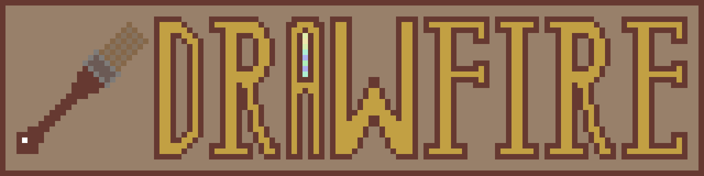

**Drawfire** is simple drawing application made on [Nimfire framework](https://github.com/Toma400/Nimfire)
as example to learn code from. However, process of writing it was also fun enough
for me to decide to make it an app on its own.  
Don't expect anything groundbreaking - it is just fun side-project and it won't get
anywhere close to legends like Krita or GIMP. It's still fun to play with.

### What features does it have?
It allows you to draw with few predetermined colours, as well as adjust brush size
and type. It exports images to PNG, of strict size 800x600.  
From advantages it has I would definitely say that it is extremely small - so if you
want to draw something really quickly, it will definitely be possible.

Additionally, you can feel safe with Nimfire drawing - it follows "no images lost"
rule which means that you will never mistakingly overwrite any image you work on.  
Whatever you save, is saved as new file, and whatever image you load and save after
editing, is saved also as new file. While this may feel chaotic, it ensures you will
always have as many history points of your image as you want.

### How to use it?
Whenever you run the app, you get empty canvas. Draw with your mouse.  
Here are shortcuts that you will need:

|    Key(s)    | Usage                            |
|:------------:|:---------------------------------|
|    MOUSE     | Use any of mouse buttons to draw |
|     TAB      | Saves the image                  |
|      Q       | Clears the canvas                |
|      T       | Changes transparency of canvas   |
|  UP / DOWN   | Changes size of brush            |
| LEFT / RIGHT | Changes brush type               |
|  `[` / `]`   | Change angle of dynamic brush    |

If you are not sure about something, please refer to [PDF Manual](docs/Drawfire%20Manual.pdf).
It also comes with Drawfire bundle on [releases page](https://github.com/Toma400/Drawfire/releases).

### Feature chart
None of features listed as `todo` here is promised to be completed.
[See changelog for brief overview of changes](changelog.md).

- [x] Basics
  - [x] Changing brush size 
  - [ ] Filling tool
  - [ ] Eraser
- [x] Colour
  - [x] Predefined colour picker 
  - [ ] Fluid colour picker 
- [x] Brushes
  - [x] Notifier of current brush type & size 
  - [x] Various brushes
    - [x] Circle brush 
  - [ ] Custom brushes
    - [ ] JSON-driven
    - [ ] PNG-driven <!-- reading matrix and creating specific brush through it? -->
- [X] Saving the image
- [x] Loading the image
- [ ] Advanced
  - [ ] Layers 
  - [x] Transparency support
- [ ] APIs
  - [ ] Wacom 

<!--
### 0.2.2
[ ] Switchable pallettes? (by default `colours.json` is used, but you can have
    multiple JSONs with different numbers (`colours2.json`, `colours3.json`) and
    you can swap them mid-drawing using new buttons which would reload them?
[ ] Copy to clipboard
[ ] Eraser (?)
    - would just set pencil to background colour and reversely, remembering last
      colour used
### 0.2.3
[ ] Proper separating of transparency and background (commented out idea?)
[ ] Fill bucket
### 0.2.4
[ ] JSON-driven or PNG-driven custom brushes?
[ ] "Autosave" mode that saves images each 10/20/30 seconds in separate folder
    and keeps last 50 versions?

### 0.3.0
-- versions before 0.3.0 gets called "Legacy" and are updated only with
   major features in 0.2.n, code gets copy-split into different branch?
[ ] Revamping Drawfire GUI with Dylan's textures? :woa:
[ ] Layers
[ ] HSV picker
[ ] Transparency picker

### 0.4.0
[ ] Wacom support

### 0.5.0
[ ] Ctrl+Z? (would need storing last draws in some sequence of specific size
             but this has capacity/lag issues and also would be hard to control
             without some good precise timer)

### 0.6.0? (very experimental idea)
[ ] Multidimensional/sized images? (bigger/smaller than 800x600?)
[ ] Connected to earlier - glass tool that makes canvas bigger/smaller?