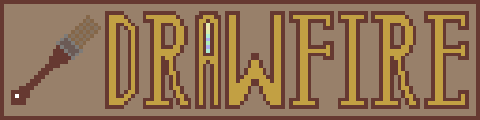

**Drawfire** is simple drawing application made on [Nimfire framework](https://github.com/Toma400/Nimfire)
as example to learn code from. However, process of writing it was also fun enough
for me to decide to make it an app on its own.  
Don't expect anything groundbreaking - it is just fun side-project and it won't get
anywhere close to legends like Krita or GIMP. It's still fun to play with.

### What features does it have?
It allows you to draw with few predetermined colours, as well as adjust brush size
and type. It exports images to PNG, of strict size 800x600.  
From advantages it has I would definitely say that it is extremely small - so if you
want to draw something really quickly, it will definitely be possible.

### How to use it?
Whenever you run the app, you get empty canvas. Draw with your mouse.  
Here are shortcuts that you will need:

|    Key(s)    | Usage                            |
|:------------:|:---------------------------------|
|    MOUSE     | Use any of mouse buttons to draw |
|     TAB      | Saves the image                  |
|      Q       | Clears the canvas                |
|      T       | Changes transparency of canvas   |
|  UP / DOWN   | Changes size of brush            |
| LEFT / RIGHT | Changes brush type               |
|  `[` / `]`   | Change angle of dynamic brush    |
|      B       | Changes brush colour to black    |
|      W       | Changes brush colour to white    |
|      L       | Changes brush colour to blue     |
|      G       | Changes brush colour to green    |
|      R       | Changes brush colour to red      |
|      Y       | Changes brush colour to yellow   |
|      P       | Changes brush colour to purple   |

### Feature chart
None of features listed as `todo` here is promised to be completed.
[See changelog for brief overview of changes](changelog.md).

- [x] Basics
  - [x] Changing brush size 
  - [ ] Filling tool
  - [ ] Eraser
- [x] Colour
  - [x] Predefined colour picker 
  - [ ] Fluid colour picker 
- [x] Brushes
  - [x] Notifier of current brush type & size 
  - [x] Various brushes
    - [x] Circle brush 
  - [ ] Custom brushes
    - [ ] JSON-driven
    - [ ] PNG-driven <!-- reading matrix and creating specific brush through it? -->
- [X] Saving the image
- [ ] Loading the image <!-- load.png is loaded and checked for boundaries
                             would require Nimfire to make reverse 'toRect' -->
- [ ] Advanced
  - [ ] Layers 
  - [x] Transparency support
- [ ] APIs
  - [ ] Wacom 

<!-- 0.2.1:
- predefined colours (16, maybe more?) should be JSON-based if JSON is available
  (it checks for JSON, if not it loads default colors, if exists it takes RGB into slots)
- same with brushes, however default brushes are always there
  - brushes can be JSON driven or PNG driven

### 0.2.1
[ ] More colours
[ ] Proper separating of transparency and background (commented out idea?)
[ ] Load images
[ ] Fill bucket
[ ] Copy to clipboard
### 0.2.2
[ ] HSV picker
[ ] JSON-driven or PNG-driven custom brushes?
### 0.3.0
[ ] Layers